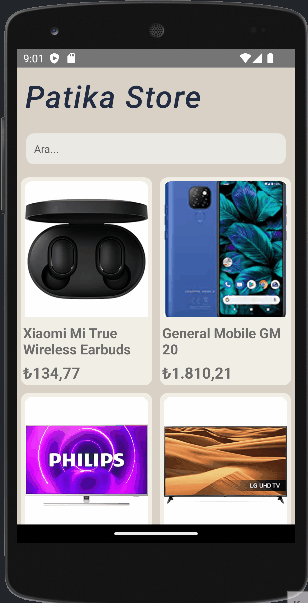

<h1 style="text-align:center">React Native PatikaStore App</h1>
<h6>Components use in App : FlatList,ScrollView,Image,TextInput,Dimensions,StyleSheet</h6>

<h6>Features of App :
<ul>
<li>User can see product list</li>
<li>User can see product list by search</li>
</ul>

